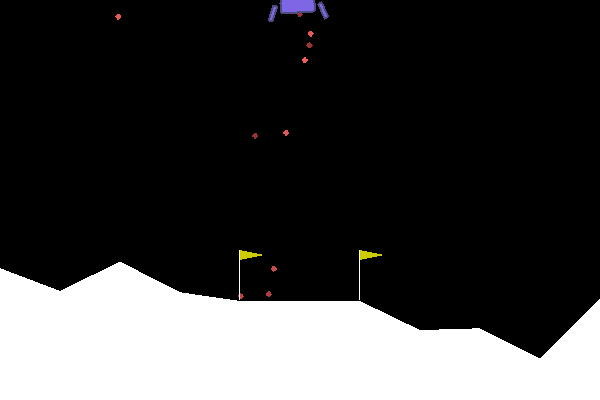
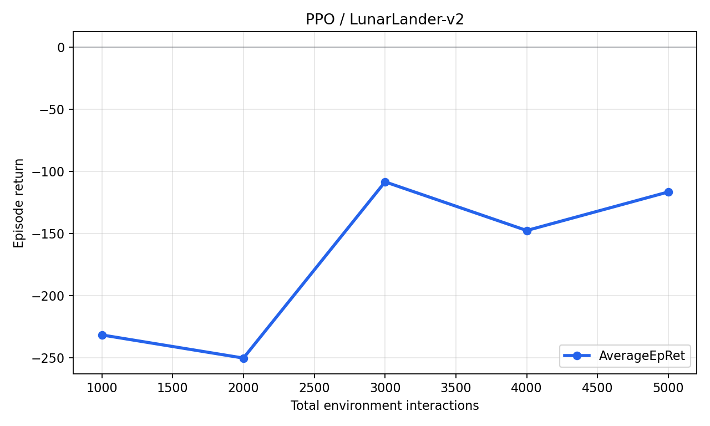
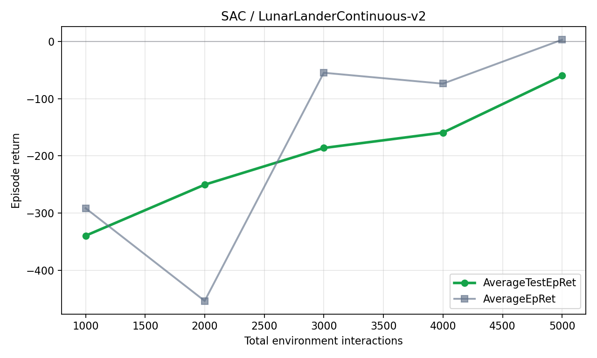
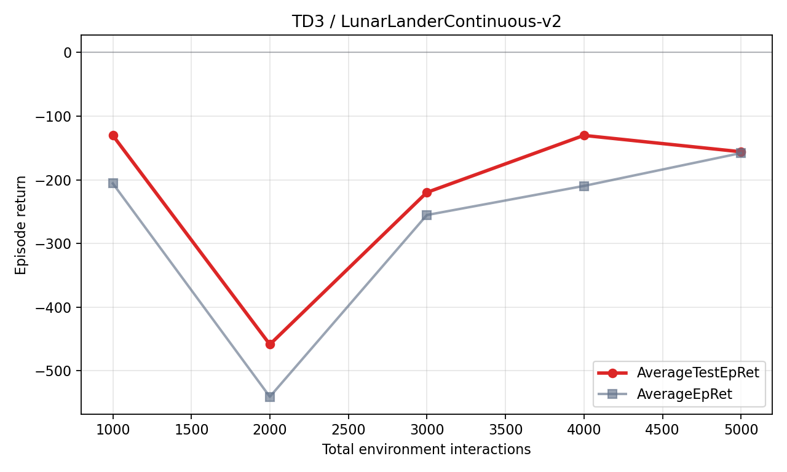

# spinningup-study

OpenAI Spinning Up 코드를 사용해서 강화학습 알고리즘 PPO, SAC, TD3를 직접 실행해보는 스터디용 저장소입니다. 이 README는 처음 실습하는 학생이 그대로 따라 할 수 있도록 설치, 실행 명령, 결과 로그 해석, 플롯 확인 방법을 정리했습니다.

원본 프로젝트 소개 문서는 [readme.md](readme.md)에 남겨두었습니다.

## 실습 목표

이 저장소에서 확인할 알고리즘은 다음 3개입니다.

| 알고리즘 | 환경 | Action space | 핵심 아이디어 |
| --- | --- | --- | --- |
| PPO | `LunarLander-v2` | Discrete(4) | 현재 정책을 너무 크게 바꾸지 않도록 clipping을 사용해 안정적으로 policy를 업데이트합니다. |
| SAC | `LunarLanderContinuous-v2` | Box(2) | entropy를 보상에 포함해 exploration을 유지하면서 actor-critic을 학습합니다. |
| TD3 | `LunarLanderContinuous-v2` | Box(2) | DDPG의 Q-value overestimation을 줄이기 위해 twin Q networks와 delayed policy update를 사용합니다. |

## 환경 사진

### LunarLander-v2

PPO 실습에서 사용하는 discrete action 환경입니다. agent는 왼쪽 엔진, 오른쪽 엔진, 메인 엔진, 아무것도 안 하기 중 하나를 선택합니다.


### LunarLanderContinuous-v2

SAC와 TD3 실습에서 사용하는 continuous action 환경입니다. agent는 메인 엔진과 side engine의 연속적인 출력을 조절합니다.



## 설치

이 repo는 오래된 Spinning Up 코드와 Python 3.6 기반 실습 환경을 맞춰둔 버전입니다. 아래 순서로 설치합니다.

### Prerequisites (선행 설치)
`mpi4py` 패키지 빌드를 위해 리눅스 시스템에 MPI 라이브러리가 반드시 설치되어 있어야 합니다. 콘다 환경을 만들기 전에 아래 명령어를 터미널에 실행해 주세요.

```bash
sudo apt update && sudo apt install libopenmpi-dev -y

```bash
cd ~/spinningup-study

conda create -n spinningup python=3.6.13 -y
conda activate spinningup

python -m pip install -r requirements.txt
python -m pip install -e . --no-deps
```

주의할 점:

```bash
pip install requirements.txt
```

위 명령은 틀린 명령입니다. 반드시 `-r` 옵션을 붙입니다.

```bash
python -m pip install -r requirements.txt
```

실행 중 아래 CUDA 경고가 나올 수 있습니다.

```text
Could not load dynamic library 'libcudart.so.11.0'
Ignore above cudart dlerror if you do not have a GPU set up on your machine.
```

CPU로 실습할 때는 무시해도 됩니다.

## 직접 실행한 smoke run

README 작성을 위해 아래 3개 실험을 직접 실행했습니다. 모두 빠른 확인용 smoke run이므로 최종 성능을 보기 위한 긴 학습은 아닙니다.

| 알고리즘 | 실행 환경 | Epochs | TotalEnvInteracts | 첫 성능 | 마지막 성능 | 성능 컬럼 |
| --- | --- | ---: | ---: | ---: | ---: | --- |
| PPO | `LunarLander-v2` | 5 | 5,000 | -231.5 | -116.4 | `AverageEpRet` |
| SAC | `LunarLanderContinuous-v2` | 5 | 4,999 | -339.6 | -60.0 | `AverageTestEpRet` |
| TD3 | `LunarLanderContinuous-v2` | 5 | 4,999 | -130.3 | -156.0 | `AverageTestEpRet` |

해석:

- return은 한 episode에서 받은 reward의 합입니다.
- 값이 클수록 좋습니다.
- 짧은 smoke run에서는 TD3처럼 마지막 값이 흔들릴 수 있습니다.
- 안정적인 비교를 하려면 `epochs`, `steps_per_epoch`, seed 수를 늘려야 합니다.

## 전체 비교 플롯

아래 그래프는 README용으로 직접 실행한 3개 smoke run의 결과입니다.


PPO는 training episode return인 `AverageEpRet`를 표시했습니다. SAC와 TD3는 매 epoch마다 deterministic policy로 test episode를 돌리므로 `AverageTestEpRet`를 표시했습니다.

## PPO 실행 방법

### 빠른 실습 명령

```bash
conda activate spinningup
cd ~/spinningup-study

python -m spinup.run ppo \
  --hid "[32,32]" \
  --env LunarLander-v2 \
  --exp_name readme_ppo_lunarlander \
  --gamma 0.999 \
  --epochs 5 \
  --steps_per_epoch 1000 \
  --save_freq 1
```

### PPO 결과 예시

실행이 끝나면 아래 파일이 생성됩니다.

```text
data/readme_ppo_lunarlander/readme_ppo_lunarlander_s0/progress.txt
```

README 작성 시 실제로 나온 마지막 epoch 결과는 다음과 같습니다.

| Metric | Value |
| --- | ---: |
| Epoch | 4 |
| AverageEpRet | -116.4 |
| TotalEnvInteracts | 5,000 |
| LossPi | 9.61e-08 |
| LossV | 8.96e+03 |
| Entropy | 1.35 |
| KL | 0.00988 |



### PPO 플롯 확인

```bash
python -m spinup.run plot data/readme_ppo_lunarlander/readme_ppo_lunarlander_s0
```

그래프에서는 x축이 `TotalEnvInteracts`, y축이 `Performance`입니다. PPO에서 `Performance`는 내부적으로 `AverageEpRet`를 의미합니다.

## SAC 실행 방법

SAC는 continuous action 환경에서 사용합니다. `LunarLander-v2`는 discrete action 환경이라 SAC 예제로는 `LunarLanderContinuous-v2`를 사용합니다.

### 빠른 실습 명령

```bash
conda activate spinningup
cd ~/spinningup-study

python -m spinup.run sac \
  --hid "[32,32]" \
  --env LunarLanderContinuous-v2 \
  --exp_name readme_sac_lunarlandercontinuous \
  --epochs 5 \
  --steps_per_epoch 1000 \
  --start_steps 500 \
  --update_after 500 \
  --update_every 50 \
  --num_test_episodes 2 \
  --max_ep_len 500 \
  --save_freq 1
```

### SAC 결과 예시

실행이 끝나면 아래 파일이 생성됩니다.

```text
data/readme_sac_lunarlandercontinuous/readme_sac_lunarlandercontinuous_s0/progress.txt
```

README 작성 시 실제로 나온 마지막 epoch 결과는 다음과 같습니다.

| Metric | Value |
| --- | ---: |
| Epoch | 5 |
| AverageEpRet | 2.88 |
| AverageTestEpRet | -60.0 |
| TotalEnvInteracts | 4,999 |
| LossPi | 7.02 |
| LossQ | 29.7 |
| AverageQ1Vals | -8.0 |
| AverageLogPi | 0.509 |



### SAC 플롯 확인

```bash
python -m spinup.run plot data/readme_sac_lunarlandercontinuous/readme_sac_lunarlandercontinuous_s0
```

SAC에서 `Performance`는 `AverageTestEpRet`를 의미합니다. 실습 로그에는 학습 중 episode return인 `AverageEpRet`와 test policy return인 `AverageTestEpRet`가 둘 다 들어 있습니다.

## TD3 실행 방법

TD3도 continuous action 환경에서 사용합니다. SAC와 같은 `LunarLanderContinuous-v2`로 실행하면 두 off-policy 알고리즘을 비교하기 좋습니다.

### 빠른 실습 명령

```bash
conda activate spinningup
cd ~/spinningup-study

python -m spinup.run td3 \
  --hid "[32,32]" \
  --env LunarLanderContinuous-v2 \
  --exp_name readme_td3_lunarlandercontinuous \
  --epochs 5 \
  --steps_per_epoch 1000 \
  --start_steps 500 \
  --update_after 500 \
  --update_every 50 \
  --num_test_episodes 2 \
  --max_ep_len 500 \
  --save_freq 1
```

### TD3 결과 예시

실행이 끝나면 아래 파일이 생성됩니다.

```text
data/readme_td3_lunarlandercontinuous/readme_td3_lunarlandercontinuous_s0/progress.txt
```

README 작성 시 실제로 나온 마지막 epoch 결과는 다음과 같습니다.

| Metric | Value |
| --- | ---: |
| Epoch | 5 |
| AverageEpRet | -158.0 |
| AverageTestEpRet | -156.0 |
| TotalEnvInteracts | 4,999 |
| LossPi | 10.9 |
| LossQ | 62.0 |
| AverageQ1Vals | -12.3 |
| AverageQ2Vals | -12.3 |



### TD3 플롯 확인

```bash
python -m spinup.run plot data/readme_td3_lunarlandercontinuous/readme_td3_lunarlandercontinuous_s0
```

TD3에서 `Performance`는 `AverageTestEpRet`입니다. TD3는 deterministic policy에 exploration noise를 더해 학습하고, test 시에는 noise 없이 평가합니다.

## 더 오래 학습하려면

위 명령들은 README용 빠른 검증입니다. 실제 학습 곡선을 더 안정적으로 보고 싶으면 다음 값을 늘립니다.

| 파라미터 | 의미 | 추천 |
| --- | --- | --- |
| `epochs` | policy update를 몇 번 반복할지 | 50 이상 |
| `steps_per_epoch` | epoch마다 환경과 상호작용하는 step 수 | 4000 이상 |
| `num_test_episodes` | SAC/TD3에서 평가 episode 수 | 10 이상 |
| seed 수 | random seed를 여러 개 돌려 평균을 낼지 | 3개 이상 |

예를 들어 PPO를 조금 더 길게 돌리려면 다음과 같이 실행합니다.

```bash
python -m spinup.run ppo \
  --hid "[32,32]" \
  --env LunarLander-v2 \
  --exp_name ppo_lunarlander_long \
  --gamma 0.999 \
  --epochs 50 \
  --steps_per_epoch 4000
```

## 로그 파일 읽는 법

Spinning Up은 각 실험마다 다음 구조로 로그를 저장합니다.

```text
data/<exp_name>/<exp_name>_s<seed>/
  config.json
  progress.txt
  vars.pkl
  pyt_save/model.pt
```

중요한 파일은 `progress.txt`입니다. tab-separated table이라 pandas로 바로 읽을 수 있습니다.

```python
import pandas as pd

df = pd.read_table("data/readme_ppo_lunarlander/readme_ppo_lunarlander_s0/progress.txt")
print(df[["Epoch", "TotalEnvInteracts", "AverageEpRet"]])
```

자주 보는 컬럼:

| 컬럼 | 의미 |
| --- | --- |
| `Epoch` | 현재 epoch 번호 |
| `AverageEpRet` | training episode reward 평균 |
| `AverageTestEpRet` | test episode reward 평균, SAC/TD3 같은 off-policy 알고리즘에서 중요 |
| `EpLen` | episode 길이 평균 |
| `TotalEnvInteracts` | 지금까지 환경과 상호작용한 총 step 수 |
| `LossPi` | policy loss |
| `LossV` | value function loss, PPO에서 사용 |
| `LossQ` | Q-network loss, SAC/TD3에서 사용 |
| `Entropy` | policy entropy, PPO에서 exploration 정도를 볼 때 유용 |
| `KL` | PPO에서 old policy와 new policy 차이 |

## 플롯이 열리지 않을 때

서버나 원격 터미널처럼 GUI가 없는 환경에서는 `plot` 명령이 창을 띄우지 못할 수 있습니다. 그 경우 학습 자체가 실패한 것은 아닙니다. `progress.txt`가 있는지 먼저 확인합니다.

```bash
ls data/readme_ppo_lunarlander/readme_ppo_lunarlander_s0/progress.txt
```

GUI 환경에서는 다음 명령으로 창이 열려야 합니다.

```bash
python -m spinup.run plot data/readme_ppo_lunarlander/readme_ppo_lunarlander_s0
```

## 정리

- PPO는 `LunarLander-v2`처럼 discrete action 환경에서도 바로 사용할 수 있습니다.
- SAC와 TD3는 continuous action 환경을 사용해야 하므로 `LunarLanderContinuous-v2`로 실습했습니다.
- 짧은 smoke run은 설치와 코드 동작 확인용입니다.
- 의미 있는 성능 비교를 하려면 더 긴 학습과 여러 seed 평균이 필요합니다.
