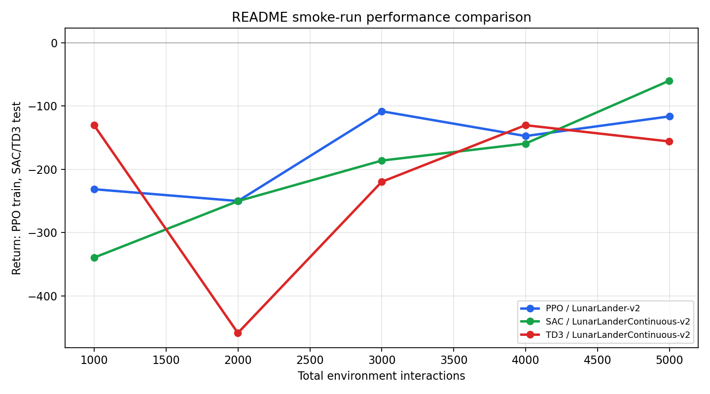

# SAC Implementation Study

OpenAI [Spinning Up in Deep RL](https://github.com/openai/spinningup)을 기반으로 PPO, SAC, TD3 등 강화학습 알고리즘을 실행하고 비교하기 위한 학습용 저장소입니다.

> 이 저장소는 재현성을 위해 Python 3.6과 구버전 Gym/TensorFlow/PyTorch 조합을 유지합니다. 최신 Python 환경과 바로 호환되는 프로젝트는 아닙니다.

## 주요 내용

- PyTorch 및 TensorFlow 1 기반 강화학습 구현
- PPO, SAC, TD3를 이용한 LunarLander 실습
- 명령줄 기반 실험 실행과 하이퍼파라미터 변경
- 학습 로그, 저장된 정책, 성능 그래프 확인

## 지원 알고리즘

| 알고리즘 | Policy | Action space | PyTorch | TensorFlow 1 |
| --- | --- | --- | :---: | :---: |
| VPG | On-policy | Discrete / Continuous | O | O |
| TRPO | On-policy | Discrete / Continuous | O | O |
| PPO | On-policy | Discrete / Continuous | O | O |
| DDPG | Off-policy | Continuous | O | O |
| TD3 | Off-policy | Continuous | O | O |
| SAC | Off-policy | Continuous | O | O |

기본 실습에서는 다음 환경을 사용합니다.

| 알고리즘 | 환경 | Action space |
| --- | --- | --- |
| PPO | `LunarLander-v2` | Discrete(4) |
| SAC | `LunarLanderContinuous-v2` | Box(2) |
| TD3 | `LunarLanderContinuous-v2` | Box(2) |

## 설치

### 권장 환경

- Python `3.6.13`
- Conda 또는 Miniconda
- OpenMPI
- Linux 권장

주요 Python 패키지 버전은 다음과 같습니다.

| 패키지 | 버전 |
| --- | --- |
| Gym | `0.15.3` |
| PyTorch | `1.3.1` |
| TensorFlow | `>=1.8.0,<2.0` |
| NumPy | `1.19.5` |

전체 버전은 [`requirements.txt`](requirements.txt)에서 확인할 수 있습니다.

### 1. 시스템 패키지 설치

Ubuntu/Debian:

```bash
sudo apt update
sudo apt install -y libopenmpi-dev swig
```

macOS(Homebrew):

```bash
brew install open-mpi swig
```

### 2. 저장소 복제

```bash
git clone https://github.com/mjjo2564-droid/sac-imp.git
cd sac-imp
```

### 3. 가상환경 및 의존성 설치

```bash
conda create -n sac-imp python=3.6.13 -y
conda activate sac-imp

python -m pip install --upgrade pip
python -m pip install -r requirements.txt
python -m pip install -e . --no-deps
```

설치 확인:

```bash
python -m spinup.run help
```

## 빠른 실행

### PPO

```bash
python -m spinup.run ppo \
  --hid "[32,32]" \
  --env LunarLander-v2 \
  --exp_name ppo_lunarlander \
  --gamma 0.999 \
  --epochs 5 \
  --steps_per_epoch 1000 \
  --save_freq 1
```

### SAC

SAC는 continuous action 환경에서 실행해야 합니다.

```bash
python -m spinup.run sac \
  --hid "[32,32]" \
  --env LunarLanderContinuous-v2 \
  --exp_name sac_lunarlander \
  --epochs 5 \
  --steps_per_epoch 1000 \
  --start_steps 500 \
  --update_after 500 \
  --update_every 50 \
  --num_test_episodes 2 \
  --max_ep_len 500 \
  --save_freq 1
```

### TD3

```bash
python -m spinup.run td3 \
  --hid "[32,32]" \
  --env LunarLanderContinuous-v2 \
  --exp_name td3_lunarlander \
  --epochs 5 \
  --steps_per_epoch 1000 \
  --start_steps 500 \
  --update_after 500 \
  --update_every 50 \
  --num_test_episodes 2 \
  --max_ep_len 500 \
  --save_freq 1
```

특정 알고리즘이 지원하는 옵션은 다음처럼 확인합니다.

```bash
python -m spinup.run sac --help
```

## 실험 결과

기본 설정에서는 프로젝트 루트의 `data/` 아래에 결과가 생성됩니다.

```text
data/<exp_name>/<exp_name>_s<seed>/
├── config.json
├── progress.txt
├── vars.pkl
└── pyt_save/
    └── model.pt
```

- `config.json`: 실험에 사용한 하이퍼파라미터
- `progress.txt`: epoch별 학습 지표
- `vars.pkl`: 저장 시점의 추가 상태
- `pyt_save/model.pt`: PyTorch 정책 및 모델

결과 그래프:

```bash
python -m spinup.run plot data/sac_lunarlander/sac_lunarlander_s0
```

저장된 정책 테스트:

```bash
python -m spinup.run test_policy data/sac_lunarlander/sac_lunarlander_s0
```

## 결과 해석

자주 확인하는 `progress.txt` 컬럼은 다음과 같습니다.

| 컬럼 | 의미 |
| --- | --- |
| `Epoch` | 현재 epoch |
| `AverageEpRet` | 학습 episode의 평균 return |
| `AverageTestEpRet` | 테스트 policy의 평균 return |
| `EpLen` | 평균 episode 길이 |
| `TotalEnvInteracts` | 환경과 상호작용한 누적 step 수 |
| `LossPi` | Policy loss |
| `LossV` | Value function loss |
| `LossQ` | Q-network loss |

짧은 5-epoch 실행은 설치와 코드 동작을 확인하는 smoke test입니다. 알고리즘 성능을 비교하려면 epoch와 `steps_per_epoch`를 늘리고, 최소 3개 이상의 seed로 실행하는 것이 좋습니다.



## 프로젝트 구조

```text
spinup/
├── algos/
│   ├── pytorch/
│   └── tf1/
├── exercises/
├── utils/
└── run.py
test/
docs/
requirements.txt
setup.py
```

## 호환성 주의사항

- 이 프로젝트는 Gym `0.15.3`의 환경 ID와 API를 사용합니다.
- SAC, TD3, DDPG는 continuous action 환경에서만 사용할 수 있습니다.
- TensorFlow 구현은 TensorFlow 1.x를 전제로 합니다.
- Apple Silicon이나 최신 운영체제에서는 Python 3.6 및 구버전 바이너리 설치가 어려울 수 있습니다. 이 경우 Linux/Conda 환경 또는 컨테이너 사용을 권장합니다.
- GUI가 없는 서버에서는 plot 창이나 환경 렌더링이 표시되지 않을 수 있지만, `progress.txt`가 생성되면 학습 로그는 정상적으로 저장된 것입니다.

## 출처 및 라이선스

이 저장소는 OpenAI Spinning Up을 기반으로 합니다. 원본 프로젝트 소개는 [`readme.md`](readme.md), 라이선스는 [`LICENSE`](LICENSE)를 참고하세요.

- OpenAI Spinning Up: <https://spinningup.openai.com/>
- Upstream repository: <https://github.com/openai/spinningup>
